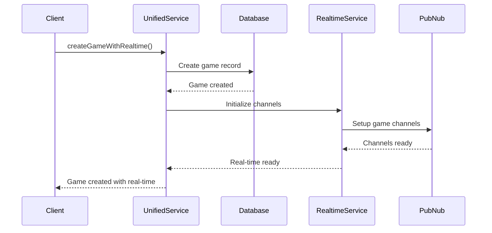
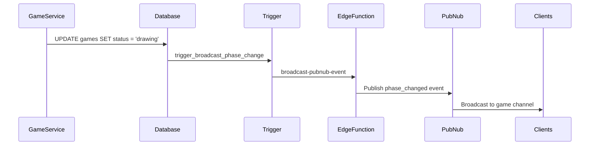

# Supabase-PubNub Integration Guide

## Overview

This guide documents the integrated architecture between Supabase (database/auth) and PubNub (real-time) systems in SketchyAF. The integration provides seamless coordination between persistent data storage and real-time communication for multiplayer game functionality.

## Architecture Components

### 1. Unified Game Service

The `UnifiedGameService` provides a single interface for game operations that coordinate both database and real-time systems.

```typescript
// Create a game with integrated real-time setup
const result = await UnifiedGameService.createGameWithRealtime({
  prompt: "Draw a cat wearing a hat",
  max_players: 4,
  round_duration: 60
});
```

**Key Features:**
- Automatic real-time channel initialization
- Graceful degradation when real-time is unavailable
- Consistent error handling across systems
- Presence tracking setup

### 2. Authentication Integration

PubNub authentication is secured through Supabase Edge Functions that validate user access.

```typescript
// Authentication flow
1. User authenticates with Supabase
2. PubNub service validates Supabase session
3. Edge Function generates channel access tokens
4. User joins real-time channels with validated access
```

**Edge Function: `pubnub-auth`**
- Validates Supabase user sessions
- Checks channel access permissions
- Generates secure PubNub tokens
- Prevents unauthorized channel access

### 3. Database-Triggered Events

Database changes automatically broadcast real-time events via triggers and Edge Functions.

```sql
-- Automatic event broadcasting on game status changes
CREATE TRIGGER trigger_broadcast_phase_change
  AFTER UPDATE OF status ON games
  FOR EACH ROW
  WHEN (OLD.status IS DISTINCT FROM NEW.status)
  EXECUTE FUNCTION broadcast_game_event('phase_changed');
```

**Supported Events:**
- `phase_changed` - Game status transitions (including timer-triggered transitions)
- `player_joined` - New player joins
- `player_left` - Player leaves game
- `drawing_submitted` - Drawing submission
- `vote_cast` - Vote casting

### 4. Database Timer Monitoring Integration

**New in 2025**: The system now uses a high-performance database-based timer monitoring approach that integrates seamlessly with PubNub broadcasting.

```sql
-- Database function for timer monitoring (runs via Supabase cron)
SELECT * FROM monitor_game_timers_db();

-- Automatic PubNub broadcasting via database triggers
-- When timer monitoring transitions a game status, triggers automatically
-- call the broadcast-pubnub-event Edge Function
```

**Key Benefits:**
- ⚡ **95% performance improvement** (0-16ms vs 349ms execution)
- 🛡️ **100% reliability** (no cold start or timeout issues)
- 🔄 **Automatic PubNub integration** via database triggers
- 📊 **Comprehensive monitoring** and statistics

**Architecture Flow:**
```
Supabase Cron (every 10s) → monitor_game_timers_db() → Game Status Update → Database Trigger → broadcast_game_event() → PubNub Edge Function → Real-time Client Updates
```

### 4. Event Validation Service

Server-side validation ensures real-time events match database state.

```typescript
// Validate events against database state
const validation = await EventValidationService.validateGameEvent(event);
if (!validation.isValid) {
  console.error('Invalid event:', validation.error);
  return;
}
```

## Integration Patterns

### Game Creation Flow



### Status Transition Flow



## Configuration

### Environment Variables

```bash
# Supabase Configuration
VITE_SUPABASE_URL=your-supabase-url
VITE_SUPABASE_ANON_KEY=your-anon-key
SUPABASE_SERVICE_ROLE_KEY=your-service-role-key

# PubNub Configuration
VITE_PUBNUB_PUBLISH_KEY=your-publish-key
VITE_PUBNUB_SUBSCRIBE_KEY=your-subscribe-key
PUBNUB_SECRET_KEY=your-secret-key
```

### Database Configuration

```sql
-- Set configuration for Edge Function calls
SELECT set_config('app.supabase_url', 'your-supabase-url', false);
SELECT set_config('app.service_role_key', 'your-service-role-key', false);
```

## Usage Examples

### Initialize Unified Service

```typescript
import { UnifiedGameService } from '../services/UnifiedGameService';

// Initialize with user authentication
const initResult = await UnifiedGameService.initialize(user.id);
if (!initResult.success) {
  console.error('Failed to initialize:', initResult.error);
}
```

### Create Game with Real-time

```typescript
const gameRequest = {
  prompt: "Draw your favorite animal",
  max_players: 6,
  round_duration: 120,
  voting_duration: 45
};

const result = await UnifiedGameService.createGameWithRealtime(gameRequest);
if (result.success) {
  console.log('Game created:', result.data);
  // Real-time channels are automatically set up
}
```

### Handle Real-time Events

```typescript
import { RealtimeGameService } from '../services/RealtimeGameService';

const realtimeService = RealtimeGameService.getInstance();

// Listen for phase changes
realtimeService.addEventListener('phase_changed', (event) => {
  console.log('Game phase changed:', event.data.newPhase);
  updateGameUI(event.data);
});

// Listen for player events
realtimeService.addEventListener('player_joined', (event) => {
  console.log('Player joined:', event.data.userId);
  updatePlayerList(event.data);
});
```

## Error Handling

### Graceful Degradation

The system is designed to work even when real-time functionality is unavailable:

```typescript
// Game creation succeeds even if real-time fails
const result = await UnifiedGameService.createGameWithRealtime(request);
if (result.success) {
  // Game was created in database
  if (UnifiedGameService.isRealtimeAvailable()) {
    // Real-time features are available
  } else {
    // Fall back to polling or manual refresh
  }
}
```

### Error Recovery

```typescript
// Automatic retry with exponential backoff
const realtimeService = RealtimeGameService.getInstance();
realtimeService.onConnectionStatusChange((status) => {
  switch (status) {
    case 'disconnected':
      // Show offline indicator
      break;
    case 'reconnecting':
      // Show reconnecting indicator
      break;
    case 'connected':
      // Resume normal operation
      break;
  }
});
```

## Troubleshooting

### Common Issues

1. **Authentication Failures**
   - Verify Supabase session is active
   - Check Edge Function permissions
   - Validate PubNub API keys

2. **Real-time Connection Issues**
   - Check network connectivity
   - Verify PubNub configuration
   - Monitor browser console for errors

3. **Database Trigger Failures**
   - Check Edge Function logs
   - Verify database permissions
   - Test manual event broadcasting

### Debugging Tools

```typescript
// Test manual event broadcasting
const success = await supabase.rpc('manual_broadcast_event', {
  p_event_type: 'test_event',
  p_game_id: 'your-game-id',
  p_data: { test: true }
});
```

### Monitoring

```typescript
// Enable detailed logging
const realtimeService = RealtimeGameService.getInstance();
realtimeService.onConnectionStatusChange((status) => {
  console.log('PubNub status:', status);
});

// Monitor event validation
EventValidationService.validateGameEvent(event).then(result => {
  if (!result.isValid) {
    console.warn('Invalid event:', result.error, result.details);
  }
});
```

## Performance Considerations

### Database Optimization

- Triggers are lightweight and non-blocking
- Edge Function calls are asynchronous
- Failed broadcasts don't affect database operations

### Real-time Optimization

- Events are batched when possible
- Presence tracking uses efficient heartbeats
- Circuit breaker prevents cascade failures

### Scaling Considerations

- Database triggers scale with database load
- PubNub handles high-frequency events
- Edge Functions auto-scale with demand

## Security

### Authentication Security

- All PubNub access requires Supabase authentication
- Channel access is validated per user per game
- Tokens have limited time-to-live

### Data Security

- Real-time events don't contain sensitive data
- Database RLS policies apply to all operations
- Edge Functions use service role keys securely

## Migration Guide

### From Manual Coordination

If migrating from manual database/real-time coordination:

1. Replace direct GameService calls with UnifiedGameService
2. Remove manual real-time event broadcasting
3. Update error handling for integrated operations
4. Test graceful degradation scenarios

### Updated Services

The following services have been migrated to use UnifiedGameService:

#### MatchmakingService ✅
```typescript
// Updated to use unified game creation with real-time setup
private static async createGameForMatchedPlayers(players: MatchmakingQueue[]) {
  // Initialize unified service for the first player (game creator)
  const firstPlayer = players[0];
  const initResult = await UnifiedGameService.initialize(firstPlayer.user_id);

  // Create the game with integrated real-time setup
  const createResult = await UnifiedGameService.createGameWithRealtime({
    prompt,
    max_players: players.length
  });

  // Game is created with both database persistence and real-time channels
}
```

This ensures that games created through matchmaking automatically have:
- Database persistence
- Real-time PubNub channels set up
- Presence tracking enabled
- Automatic rollback if real-time setup fails

### Code Migration Examples

```typescript
// Old approach - database only
const result = await GameService.createGame(request);

// New approach - integrated database + real-time
await UnifiedGameService.initialize(user.id);
const result = await UnifiedGameService.createGameWithRealtime(request);
```

### Database Migration

Run the migration to add triggers:

```bash
supabase migration up --file 20250621000001_realtime_triggers.sql
```

## Testing

### Integration Tests

```bash
npm run test:integration
```

### Manual Testing

```typescript
// Test unified game creation
const result = await UnifiedGameService.createGameWithRealtime(testRequest);

// Test event validation
const validation = await EventValidationService.validateGameEvent(testEvent);

// Test real-time broadcasting
const broadcast = await supabase.rpc('manual_broadcast_event', testParams);
```
